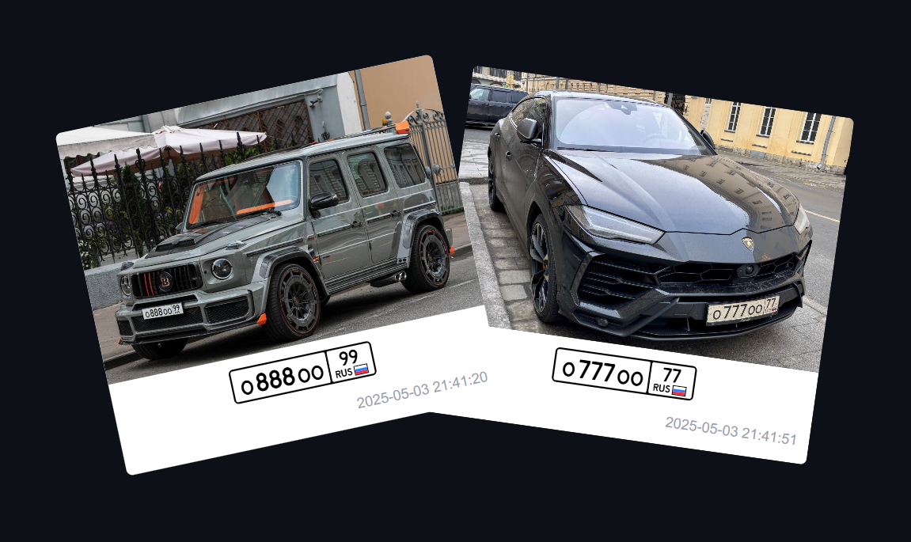

# Platesmania frontend

A web service designed to manage and showcase a gallery of car license plates

  

## Linked projects

[platesmania-backend](https://github.com/EgorVelikiy/devops-server)

[platesmania-infrastructure](https://github.com/sarkiisov/platesmania-infrastructure)

## Stack

Vite, React, TypeScript, Tailwind v4, React hook form, Zod
